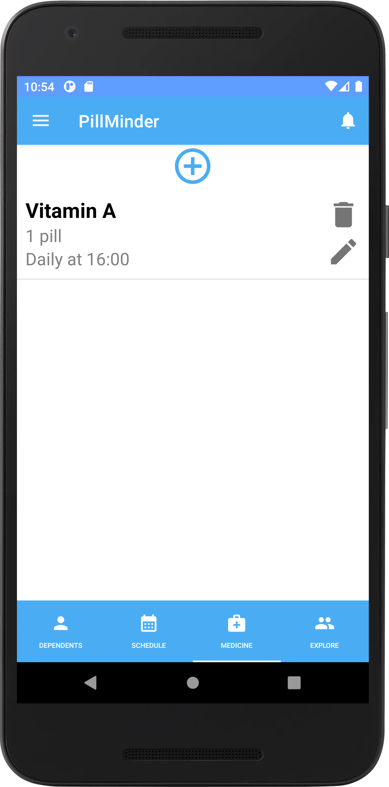
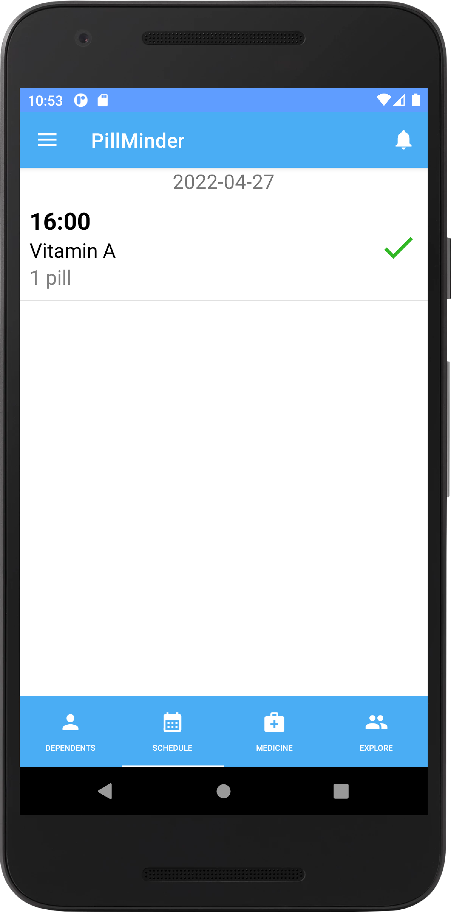

# Краткое описание:
Наглядное и простое в использовании приложение с удобным интерфейсом, позволяющее контролировать прием лекарств.  
Трекер приема лекарств с системой напоминаний, статистикой принятых лекарств и возможностью подключения родственников и друзей.

# Полное описание:
*PillMinder* - удобное приложение, которое позволяет контролировать прием лекарств.  
В момент приема необходимого лекарства приложение пришлет напоминание с уточнением, что нужно принять и в какой дозировке.  
С помощью нескольких простых действий можно добавлять лекарства, указывая время и дату приема, а также при необходимости удалять и редактировать текущие.
Внутри приложения поддерживается статистика приема с возможностью отмечать статус приема на день: был ли прием осуществлен или пропущен. Пользователь может просматривать информацию за предыдущие приемы и тем самым следить за динамикой лечения.  
При желании в приложении можно добавлять наблюдателей - других пользователей приложения, которые будут следить за тем, принимаете ли вы прописанные лекарства или нет. В случае, если лекарство было пропущено, наблюдатель получит соответствующее уведомление.  
Наглядное и простое в использовании приложение с удобным интерфейсом поможет вовремя принять лекарство согласно инструкции.  
*Особенности приложения PillMinder:*
- Надежное приложения для трекера приема лекарств
- Удобная система напоминаний о приеме
- Пользовательский интерфейс для родственников и друзей
- Хранение статистики прошлых приемов
# Иконка

# Feature Graphic

# Скриншоты

